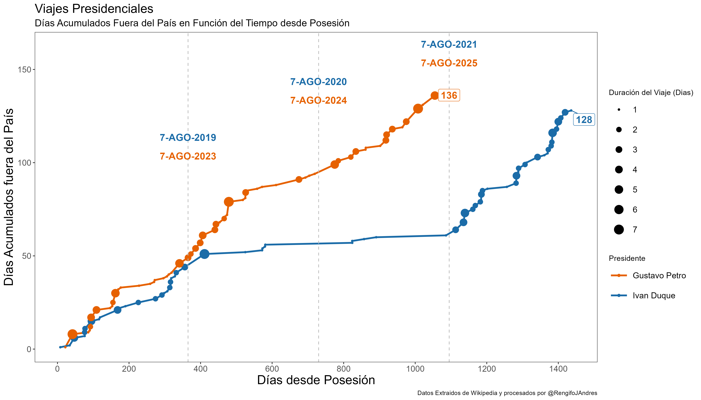
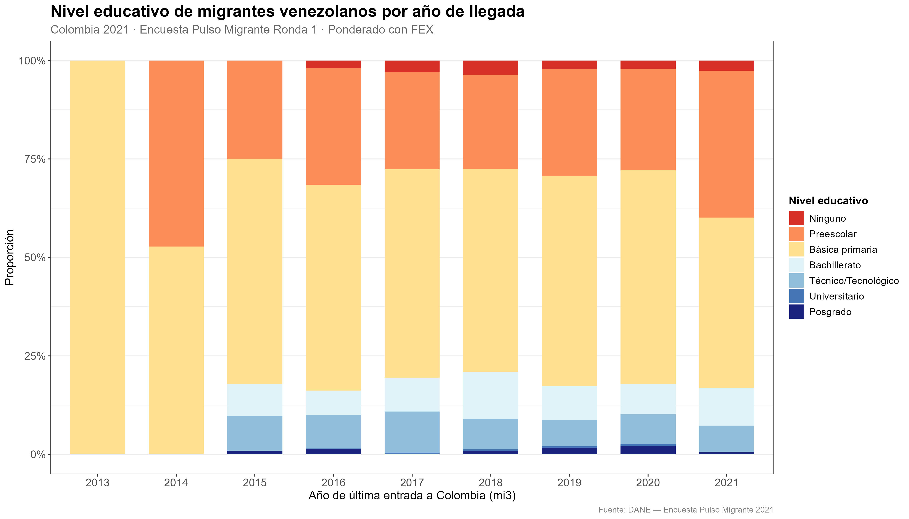
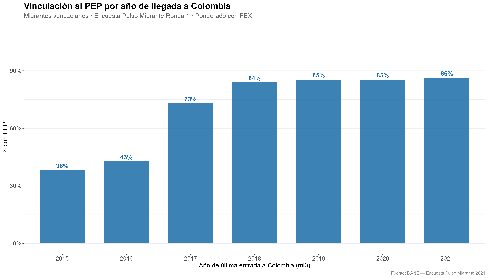
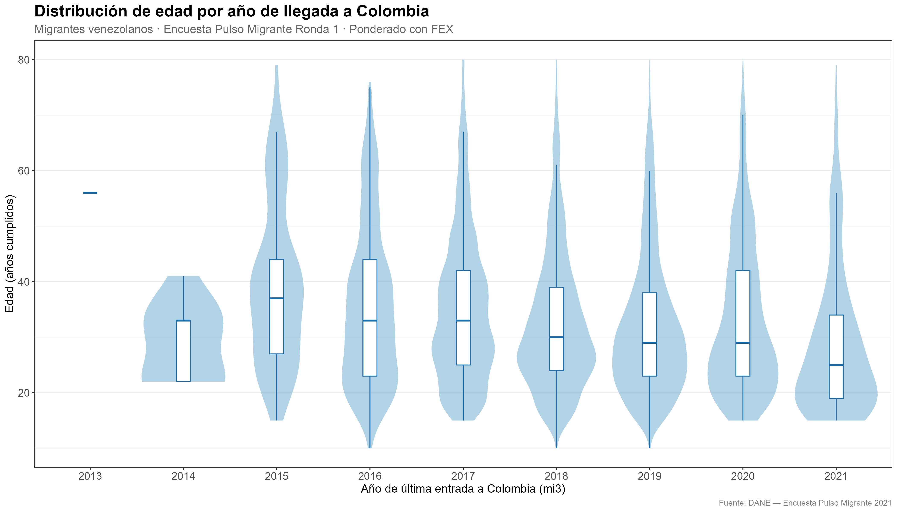
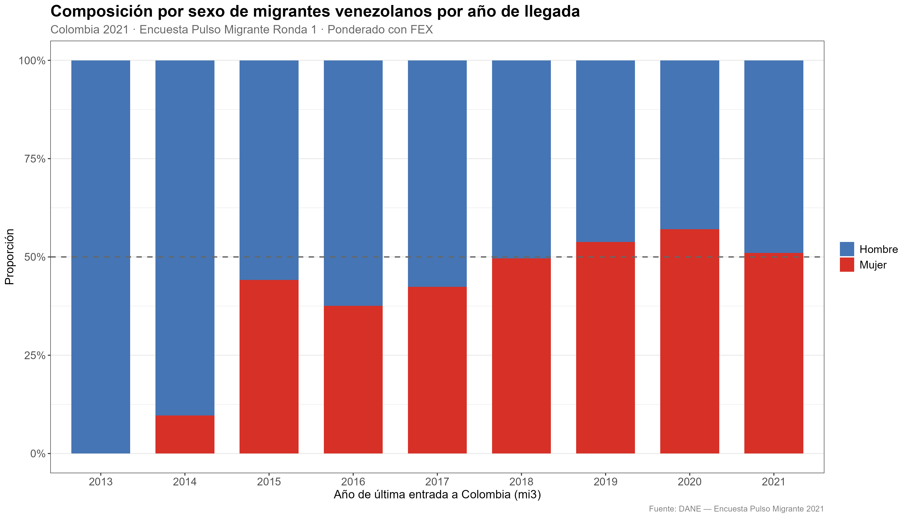
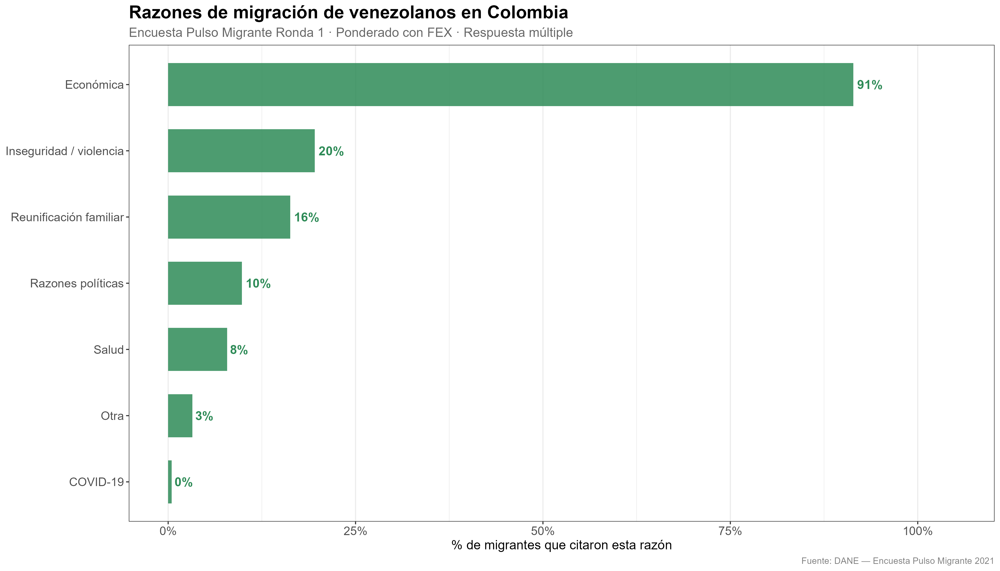
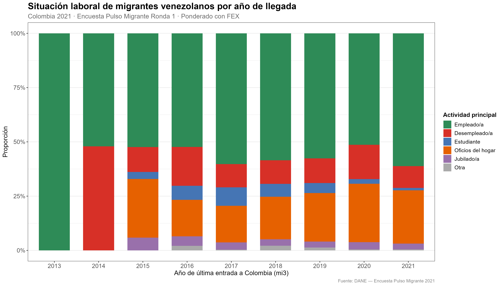

# Repositorio con proyectos de análisis de datos, data mining y otras cositas. 

## 1)  Viajes Presidenciales: 
Descubramos los viajes de este y el anterior gobierno. 
Usando herramientas de limpieza de datos, webscraping y visualización de datos.  

## 7) Encuesta Pulso Migrante — Migrantes venezolanos en Colombia
Análisis de la primera ronda de la Encuesta Pulso Migrante (DANE, 2021), enfocado en la población venezolana residente en Colombia. Se exploran dos dimensiones clave:

- **Nivel educativo por año de llegada:** cómo varía la composición educativa de los migrantes según cuándo entraron al país, ponderado por el factor de expansión (FEX).
- **Vinculación al PEP por año de llegada:** qué proporción de migrantes obtuvo el Permiso Especial de Permanencia (PEP) según su año de entrada a Colombia (variable `mi3`).
- **Distribución de edad por año de llegada:** violin plot con boxplot interno mostrando cómo cambia el perfil etario de los migrantes según el año de llegada.
- **Composición por sexo por año de llegada:** evolución de la proporción hombre/mujer entre las distintas cohortes de llegada.
- **Razones de migración:** proporción de migrantes que citó cada razón de salida de Venezuela (respuesta múltiple): económica, familiar, inseguridad, política, salud, entre otras.
- **Situación laboral por año de llegada:** cómo se distribuyen las actividades principales (empleo, desempleo, estudio, hogar) según el año de entrada al país.

